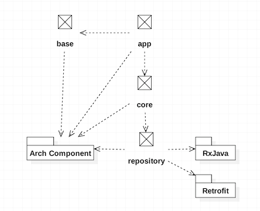

# MVVM Template(Cheers)

This repository provides templates which would be based on MVVM for Android application development.

The code-base will be from very begin to complicate use-cases. The purpose of the template is to ease starting Android application development with MVVM. Because of MVVM the templates use Android [databinding](https://developer.android.com/topic/libraries/data-binding/index.html) which can help us to write declarative layouts and minimize the glue code necessary to bind your application logic and layouts. 

> The code-base based on [Android Architecture Components](https://developer.android.com/topic/libraries/architecture/index.html).
 
 
# This is not a library

Don't think that you can include it and build with your code directly. These codes here are template that you can replace and build your own features.

# Pattern included

- General [GOF](https://en.wikipedia.org/wiki/Design_Patterns) patterns
- Repository pattern to provide data
- Background task(job) implementation before [v0.4](https://github.com/XinyueZ/mvvm-template/tree/feature/v0.4)
1. [Actor](http://www.brianstorti.com/the-actor-model/?utm_source=android-arsenal.com&utm_medium=referral&utm_campaign=6127)
2. An implementation of actor model based on [Rx-Android](https://github.com/ReactiveX/RxAndroid)


# Kotlin

Since the official announcement of the Kotlin langauge on Android at Google I/O 2017 the Android Studio has provided stable plugIn for this language and can be very confirmed that the Kotlin would be main language on Android platform. 

All templates would/have been written in *Kotlin* in order to fellow new tech.

# History

- [v0.5 in dev](https://github.com/XinyueZ/mvvm-template/tree/dev)

[](https://travis-ci.org/XinyueZ/mvvm-template)


- [Instant-app integrated in v0.5](https://github.com/XinyueZ/mvvm-template/tree/feature/instant-app)

[](https://travis-ci.org/XinyueZ/mvvm-template)

> Removed [Rx-Android](https://github.com/ReactiveX/RxAndroid), or RxJava

1. Use  [coroutines](https://github.com/Kotlin/kotlinx.coroutines/blob/master/coroutines-guide.md) instead  [Rx-Android](https://github.com/ReactiveX/RxAndroid) to support repository
2. Use  [coroutines](https://github.com/Kotlin/kotlinx.coroutines/blob/master/coroutines-guide.md) to implement [Actor](http://www.brianstorti.com/the-actor-model/?utm_source=android-arsenal.com&utm_medium=referral&utm_campaign=6127)
3. Added detail page of product
4. Compare two different ways for item-opening on list
    - Click through [channel](https://github.com/XinyueZ/mvvm-template/blob/bd437884779a3d4a388262b261bfaeb5c70434c1/core/src/main/kotlin/com/template/mvvm/models/SoftwareLicensesViewModel.kt#L183-L183)  <- It won't be used in future, because channel runs without resource free, another [example](https://github.com/XinyueZ/mvvm-template/blob/dev/core/src/main/kotlin/com/template/mvvm/models/ProductsViewModel.kt#L166)
    - Click through actor. The actor encapsulates channel which can be managed by parent like UI. [issue](https://github.com/Kotlin/kotlinx.coroutines/issues/140)
        - Make [view-extension to extend view's onclick-listener](https://github.com/XinyueZ/mvvm-template/blob/70cd0d7453d8a7da735f859b97fc3875747c6421/core/src/main/kotlin/com/template/mvvm/ext/ViewModelExt.kt#L43-L43) to call coroutine-actor.
        - In [view-binding-adapter](https://github.com/XinyueZ/mvvm-template/blob/70cd0d7453d8a7da735f859b97fc3875747c6421/core/src/main/kotlin/com/template/mvvm/binding/BindingAdapters.kt#L199-L199) using new extension.
        - [Use a collection as placeholder for click-event handler in item-view-model](https://github.com/XinyueZ/mvvm-template/blob/70cd0d7453d8a7da735f859b97fc3875747c6421/core/src/main/kotlin/com/template/mvvm/models/ProductsViewModel.kt#L147), clear this collection when view-model's ```onCleared()``` is called.
5. Added tests for repository, core modules.
6. Defined flavors for ```prod``` and ```mock```.
7. Because of flavors the Retrofit call on network has been distinguished into mock/prod-feeds.
8. *Support Instant App* feature.
    > Use ```App Link Assistant``` of Android Studio  to test.
    > Example: https://drive.google.com/open?id=1l5L2FAYEAMcpRd0zxlTr2QdlgO3AmnGp
9. Added ```base-app``` as ```baseFeatrue```. The feature is at moment represent of the whole app, the ```installed``` calls ```base-app``` to start regular app.
10. Used ```controller``` for every ```ViewModel``` to hold all ```LiveData```s, used ```state``` for every ```ViewModel``` to hold all ```Observable```s .
11. A little design changes.

See:


- [v0.4](https://github.com/XinyueZ/mvvm-template/tree/feature/v0.4)

#### Great update for modularization. App based on ```app```, ```core```, ```base```, ```repository``` and ```dependencies.gradle``` would define all libraries used in the application.

|  Module | Description  |
|:-------------:|:-------------:|
|  app | UI, including activities, fragments, data-binding |
| base  | Fundation of application for base elements, base classes |
|  core |  ```view-model```s using repository as data-source to represent data on UI. |
| repository|The repository is data-center of an application. The data-center provides data remote, local or cache, including resource: *strings* |

See:




> The template is using ```product```, ```software licenses``` to demonstrate how to use MVVM to load data and show them on UI. For your own use-case, you can reset them and build your own features.  

> Use repository to populate data instead hard coding in [v0.3](https://github.com/XinyueZ/mvvm-template/tree/feature/v0.3/navi-drawer-bottom)

1. Don't use actors to drive screen. Use [LiveData](https://developer.android.com/topic/libraries/architecture/livedata.html) to change different fragments or views.
2. Use actors only for internal interaction in view-models.
3. Added ```LL``` which is a easy "logcat" to logout with filter "#!#!", you can see line-number in output directly 
i.e 

```
09-14 22:38:05.873 14776-14776/com.template.mvvm D/LL$Companion.d @line: 155: #!#!ProductsRepository::getAllProducts#!#!
09-14 22:38:05.874 14776-14776/com.template.mvvm D/LL$Companion.d @line: 155: #!#!ProductsRemote::getAllProducts#!#!
```

4. Use feature of  [LiveData](https://developer.android.com/topic/libraries/architecture/livedata.html) like switchMap, observe to populate data. (https://developer.android.com/topic/libraries/architecture/livedata.html)
5. The repository would populate data with ```remote```, ```local``` and  ```cache``` .
6. Added [Retrofit](http://square.github.io/retrofit/) to load data, use [Room](https://developer.android.com/topic/libraries/architecture/room.html) to persistent data.
7. Added [Rx-Android](https://github.com/ReactiveX/RxAndroid) to process data from source i.e ```remote``` to the [LiveData](https://developer.android.com/topic/libraries/architecture/livedata.html).
8. *NEW LIB FOR DEBUG* [Curl-Logger-interceptor](https://github.com/grapesnberries/Curl-Logger-interceptor). Use "#!#!" in output like ```LL``` to filter out what you've requested.
i.e
```
09-18 10:47:02.963 15354-16507/com.template.mvvm D/#!#!: URL: https://dl.dropboxusercontent.com/s/dxf7rgkcrsezbsw/licenses-list.json
                                                         ────────────────────────────────────────────
                                                         cURL -X GET  "https://dl.dropboxusercontent.com/s/dxf7rgkcrsezbsw/licenses-list.json" -L  
                                                         ──────────────────────────────────────────── 
```

- [v0.3](https://github.com/XinyueZ/mvvm-template/tree/feature/v0.3/navi-drawer-bottom): 

> Added application navigation driving through drawer and bottom-bar. In this version there're two dummy menu-items that will open a products and about-me view.

> To bottom-bar. According to material design the bar always navigate the app between top-level views, well, here I defined item1, item2, item3 and opening fragments for them.

1. Support full-screen app. See https://gist.github.com/chrisbanes/73de18faffca571f7292

2. Added drawer-layout for menu and header, also bottom-bar as navigation-view.

3. Support Rx, imported the libraries.

4. minAPI upper to 16 for the library of [Material Design Guideline](https://github.com/TheKhaeng/material-design-guideline).

5. Supported basic transition between activities after platform v21.

6. The ```ViewModel``` can contain some ```ViewModel```s, i.e the ```HomeViewModel``` which can contain ```DrawerSubViewModel``` to handle logical about the navigation-drawer.

7. The ```LifeActivity``` would be created by using binding, the sub-classes of ```LifeActivity``` can now use data-binding.

8. Added a software-license view.

- [v0.2](https://github.com/XinyueZ/mvvm-template/tree/feature/v0.2/splash-actor-imported): Very early with MVVM, just a home screen. (>=API 14)

  1. Added a splash screen.

  2. Use actor model to navigate app from splash to home.

- [v0.1](https://github.com/XinyueZ/mvvm-template/tree/feature/v0.1/very-early-code-base): Very early with MVVM, just a home screen. (>=API 14)

# Reference

The template has been very inspired by following repositories:

Google's Android architecture  [todo-list](https://github.com/googlesamples/android-architecture)  
Google's Android architecture-components [sample](https://github.com/googlesamples/android-architecture-components)


# License

Copyright 2015 The Android Open Source Project, Inc.

Licensed to the Apache Software Foundation (ASF) under one or more contributor license agreements. See the NOTICE file distributed with this work for additional information regarding copyright ownership. The ASF licenses this file to you under the Apache License, Version 2.0 (the "License"); you may not use this file except in compliance with the License. You may obtain a copy of the License at

http://www.apache.org/licenses/LICENSE-2.0

Unless required by applicable law or agreed to in writing, software distributed under the License is distributed on an "AS IS" BASIS, WITHOUT WARRANTIES OR CONDITIONS OF ANY KIND, either express or implied. See the License for the specific language governing permissions and limitations under the License.
